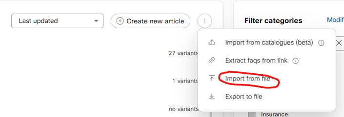

```
Last modified: Thu, 10 August 2023
```

## Import QA and Task Bots:

In this section you will important the provided QA and Task Bot in your Webex Bot Builder.


### QA Bot

1. From Webex Connect, open up the Bot Builder
2. Select New Q&A Bot and give it a name [QA BOT Name]
3. Select Allow Agent Handover and press Done
4. Select the Articles menu and then click the three dots in the top right – choose Import from File 
   
   
   

5. Select Overwrite existing articles
6. Select StandaloneDemosQABot.json from the BOTs directory.
7. Train and Make live

### Task Bot

1. From Connect, open up the Bot Builder
2. Select Task Bots, New Task Bot and Create Bot and give it a name [Task BOT Name] 
3. Press Done
4. Select the Training menu and then click the three dots in the top right – choose Import from JSON 

   

5. Select StandaloneDemosTaskBot.json from the BOTs directory.
6. Train and Make live


# Files 
1. QA Bot
2. Task Bot

<br>
<br>
---

  <script>
    document.addEventListener('DOMContentLoaded', () => {
      console.log('DOMContentLoaded OKOK')
    })

    window.addEventListener('load', () => {
      console.log('window load OK')
    })
  </script>

<p style="text-align:center"><strong>Congratulations, you have completed this lab! You can continue with the next one.</strong></p>
		
<p style="text-align:center;"></p>


[task]: \